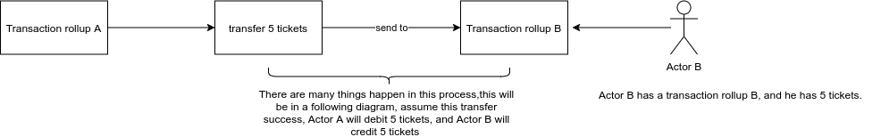

# TORU

## Glossary

* **Blockchain layer 1**: also known as the base layer, the main chain, etc. This forms a chain of blocks or blockchain.
* **Layer 2 solutions**: offer scaling capabilities. A new chain can also be created, separate from the main chain or built over the main chain. The main feature of these solutions is that most of the transactions are performed off-chain in order to avoid affecting the on-chain consensus directly. These solutions include state channels, sidechains, rollups, etc.
* **Off-chain solutions**: are classified as layer 2 solutions. By using off-chain solutions, users can move computation, storage, etc. outside the main chain. In doing so, they move from blockchain’s limited resources to more abundant off-chain resources, using the blockchain only to verify and finalize results.
* **Throughput**: is the number of transactions a system can process per second.
* **Latency**: is the time it takes to process a transaction.
* **Finality period**: the amount of time one has to wait for a reasonable assurance that completed transactions cannot be altered, reversed, or canceled.

## Introduction

### What is TORUs on Tezos?

Tezos implements optimistic rollups as optimistic transactional rollups or as transaction rollups. The transaction rollups are implemented directly as part of the economic protocol on layer 1 (thus, they are regarded as layer 2), rather than implementing rollups as smart contracts and creating a new layer on top of layer 1 like Ethereum, Bitcoin, etc… As a result, this design choice inherits the advantages feature of the protocol amendment, which allows for gas-efficient and storage-efficient designs.

### What are new in Tezos because of TORUs?

* Transaction rollup hash is TORU ID, the prefix is`tru1,`hash size is 20 bytes. The hash is computed by using the origination nonce and the operation hash. TODO&#x20;
* TORU layer 2 address, the hash of a BLS public key used to identify a layer 2 ticket holders, its prefix is `tru2`, hash size is 20 bytes. TODO
* Origination smart contract to create TORU.
* TORU node.
* Storage: Irmin integration with Merkle Tree Proof.
* BLS signatures: the minimum size of it is 48 bytes and its use longer signatures 96 bytes.
* Inbox in TORU is considered as a block on layer 1. It is used to store batches. It has a hash, the prefix is`i,`hash size is 32 bytes.
* Batch: batch stored messages or a valid list of layer 2 operations, this is what interprets off-chain. Batch size is the key to archive high TPS. It is computed as followed:
  * A combination of the size of the message size and the size of the signatures that signed for those messages.
  * The maximum number of layer 2 operations is based on: batch size divided by the average size of a layer 2 operation.
  * The maximum TPS on layer 2 is a maximum of layer 2 operations divided by the time between two blocks (Tenderbake finality).
* Messages in TORU: a message is either a batch or deposit. Messages’ size is the key to archive high TPS. Its hash size is 32 bytes. Its prefix is `M`. The size of a message is computed as followed:
  * Batch: the length of a batch.
  * Deposit: it is a sum of layer 2 ticket address size (the size of a BLS public key), ticket key hash size (size of:`Script_expr_hash,` it is 32 bytes), and the minimum amount size is 8 (int64). (ex: `dest_size d + key_hash_size 32 + amount_size 8`).
* Indexes Int64: TORU ID, TORU ticket addresses, TODO

### What is the workflow of TORUs?

* Origination smart contract: the origination will do two things
  * TORU creation
  * Deposit tickets from layer 1 to TORU.
* Operations on TORU:
  * Transfer
  * Submit batch (batch contains messages).
  * Make a commitment for the submitted batch. Then commit the commitment to a level.
  * In the finality period
    * A commitment can be rejected.
    * Retire a commitment if it is not rejected.
  * After the finality period:
    * Only one commitment is accepted for a level.
    * A finalized commitment is refused or failed to be added to a rollup because it has reached the maximum number of finalized commitments allowed.
    * The commitments that are not rejected will be removed, and their bonds return to their owners.
* Withdrawal tickets: TODO

### What are the costs/fees paid in TORUs?

* Origination cost.
* Submit a message to an inbox.
* Commitment bond when one wants to submit a commitment to a certain level on Tezos.
* TODO (rejection?)

### What will be deleted after a certain period of time?

* Inbox will be deleted after the commitment is finalized.
* When a commitment past a finality period, is not rejected and became finalized, these others commitments committed that are not rejected for that level will be removed, and the bonds will return to their owner.
* A commitment finalized for a level will be deleted after some time.

### What are the bounds on TORUs?

* Origination size
* Inbox size
* Message size
* Finality period
* Commitment bond
* A maximum number of finalized commitments are allowed in a transaction rollup.
* Withdrawal period

### What are the bounds on layer 1 that TORUs depend on?

* Consume gas limit per block
* Operations size

### What is considered bad behavior and have to pay the cost in TORUs?

Commit a wrong commitment: if the commitment is caught by a rejector in the finality period, and proved that they are indeed a wrong commitment, the bond that put up to do commitment will be slashed, half will be rewarded to the rejector, and half will be burned.

TODO

## Interaction with TORUs

### Create TORUs

* A transaction rollup is created by using the origination technique of a smart contract. One can originate as many rollups as one wants.
* This operation is signed by the source contract and returns the transaction rollup address.
*   This operation will have to pay some fee, called origination burn. This burn is a result of:

    `burn = cost_per_byte * origination_size` where:

    cost\_per\_byte = 250 Tez;

    tx\_rollup\_origination\_size = 60\_000 bytes

The burn is then debited from the source contract.

* Origination nonce with the hash of the operation is used to create a unique transaction rollup address, each time a transaction rollup is created, the nonce will then increase. There is no transaction rollup that has the same nonce (or no transaction rollup has the same address).
* Operation manager on Tezos: `tx_rollup_origination` (defined in `operation_repr.ml`)
* Fail to create transaction rollup:
  * Disable flag is set as disable while originating (create) TORU. This is only for the protocol internal test.
  * The source account is not a smart contract (aka not an implicit contract).
  * Double origination (this should not happen if it happened it is a bug): the same operation creates two different TORUs.

### Deposits tickets to TORUs

Only smart contracts can deposit tickets to a transaction rollup.

Example of a valid smart contract code to deposit 10 tickets to a transaction rollup

```
parameter (pair address tx_rollup_l2_address);
storage (unit);
code {
       # cast the address to contract type
       CAR;
       UNPAIR;
       CONTRACT %deposit (pair (ticket unit) tx_rollup_l2_address);

       IF_SOME {
                 SWAP;

                 # amount for transfer
                 PUSH mutez 0;
                 SWAP;

                 # create a ticket
                 PUSH nat 10;
                 PUSH unit Unit;
                 TICKET;

                 PAIR ;

                 # deposit
                 TRANSFER_TOKENS;

                 DIP { NIL operation };
                 CONS;

                 DIP { PUSH unit Unit };
                 PAIR;
               }
               { FAIL ; }
     }
```

These parameters are important:

* Parameter taking a pair: source address and a destination address has to be a layer 2 address (which prefix “tru2” TODO) `parameter (pair address tx_rollup_l2_address)`
* The entry point is: `deposit`
* The amount transfer must be zero: `PUSH mutez 0`

### States of TORUs

The state of a transaction rollup is a set of variables whose values vary in time, as the rollup progresses. It is composed of `burn_per_byte` and `inbox_ema`.

Not only that, but the state of a transaction rollup also keeps track of this information of different rollup levels (for more details please read the comments in `tx_rollup_state_repr.ml`):

* Commitment levels:
  * Commitment head level: it is the most recent unfinalized commitment in the layer 1 storage.
  * Commitment tail level: it is the oldest finalized commitment that is still stored in the layer 1 storage.
* Inbox levels:
  * Inbox head level: it is the most recent inbox in the layer 1 storage.
  * Inbox tail level: it is the oldest inbox that is still stored in the layer 1 storage.

Note that: inboxes and commitments can be removed from the layer 1 context under certain circumstances.

These are the states of transaction rollups:

* Initial state: this is the initial value of a transaction rollup state, after its origination.
*   Update state: update the computation of `burn_per_byte` and `inbox_ema`, each time messages are submitted to an inbox, there is a burn that needs to be paid for each byte of the messages.

    * `burn_per_byte`: the cost to be paid (in Tez) for each byte submitted to inbox.
    * `inbox_ema`: EMA is a short-term Exponential Moving Average. More details in the comments of `tx_rollup_state_repr.ml`.

    The burn is computed based on the ratio of:

    * `final_size`: it is the number of bytes it uses at the end of the construction of a Tezos block.
    * `hard_limit`: it is the maximum amount of byte an inbox can use.

| Ratio r       | burn\_per\_byte |
| ------------- | --------------- |
| r < 80%       | reduced         |
| 80% < r < 90% | constant        |
| r > 90%       | increased       |

### Inboxes in TORUs

Inbox is seen as a block for layer 2. An inbox is limited by:

* Inbox size: currently, it is 100\_000 bytes.
* Batch count limit: the maximum number of batches allowed in an inbox: currently, it is 1\_010.
* Batch size limit

### Batches

Batches are stored in an inbox of transaction rollup. To be able to store in an inbox, one needs to have:

* a batch
* submit the batch (Manager operation on Tezos: `tx_rollup_submit_batch`), there is a gas limit for this submission by default it is the maximum gas that can be consumed by an operation.
* calculate the burn cost: it is the cost per byte of messages (a list of messages stored in batch), one needs to pay to submit a batch to inbox. This cost will be debited from the source contract. There is a burn limit, if the burn cost is ≥ burn limit, it will fail. One can add as many batches as one wants to an inbox (each batch submitted will have a counter to prevent the double submission). A batch is limited by:
  * Message size: There is a limited size of messages that can be added to an inbox. Currently, it is 5\_000 bytes.
* add this operation to the incremental and then bake it to confirm/accept the operation.

### Commitment

After a batch is submitted to an inbox of a transaction rollup and has been baked (included in the context of a block), the next step is to make a commitment for this submitted batch.

* Commit to a level: A commitment is made for a level in a block. An operation manager of Tezos to commit a commitment is `tx_rollup_commit`.
* Predecessor: A commitment has to include the previous finalized commitment hash of a level before aka predecessor. If it is the first commitment, it does not have a predecessor.
* Submit bond: there is a bond that needs to be submitted to be able to make a commitment for a level, it will prevent bad commits. Currently, it is 10k Tez.
* Return bond: a bond can only be returned after the block is finalized (finalize a block by using: `finalize_block`), the rollup is finalized, and the commitment for that level is removed.
* Finalize commitments: To make a commitment finalize, after making a commitment, add the operation into the context, baking this operation, then call the operation manager `tx_rollup_finalized` to finalize the rollup with the newest context including the commitments.
* Limit of finalized commitments: there is a limit to the number of finalized commitments, it will fail to add a new commitment if it reaches this limit. The limit has to be greater than the withdrawal period.
* To remove a finalized commitment by using the operation manager `tx_rollup_remove_commitment`.

### Rejection

TODO

### Finalization

A finalized block will change the gas rates (see the state of the transaction rollup). The operation is `finalize_block`.

TODO

### Withdrawal

TODO

## Default parameters bounds in TORU

TODO

|   |   |   |
| - | - | - |
|   |   |   |
|   |   |   |
|   |   |   |

### Gas/Fee on TORU

| Gas/Fee                         | Meaning                                                                       | Requirement                                                                                         |
| ------------------------------- | ----------------------------------------------------------------------------- | --------------------------------------------------------------------------------------------------- |
| Gas cost: Message size          | The cost of gas for hashing a message of a number of size in bytes            | The error raises when the size of message is negative (size < 0). `Tx_rollup_negative_message_size` |
| Fee: burn cost when origination | The cost burning for storage when doing the origination of transaction rollup | `tx_rollup_origination_size`                                                                        |
|                                 |                                                                               |                                                                                                     |

### TORU operations

| Operations                              | Meaning                                        | Layer                     |
| --------------------------------------- | ---------------------------------------------- | ------------------------- |
| `tx_rollup_enable`                      | Enable flag for TORU                           | Layer 1 alpha context     |
| `tx_rollup_origination_size`            | Size limit of origination                      | ...                       |
| `tx_rollup_hard_size_limit_per_inbox`   | Size limit of inbox                            | ...                       |
| `tx_rollup_hard_size_limit_per_message` | Size limit oftz4 is BLS message                | ...                       |
| `tx_rollup_commitment_bond`             | The amount of bond to make a commitment        | ...                       |
| `tx_rollup_finality_period`             | Finality period                                | ...                       |
| `tx_rollup_withdraw_period`             | Withdraw period                                | ...                       |
| `tx_rollup_max_unfinalized_levels`      | The maximum number of unfinalized levels allow | ...                       |
| `tx_rollup_max_messages_per_inbox`      | The maximum number of messages allow per inbox | ...                       |
| `tx_rollup_max_finalized_levels`        | The maximum number of finalized levels allow   | ...                       |
| `tx_rollup_origination`                 | Origination or create a transaction rollup     | Layer 1 manager operation |
| `tx_rollup_submit_batch`                | Submit a batch to an inbox                     | ...                       |
| `tx_rollup_commit`                      | Commit a commitment                            | ...                       |
| `tx_rollup_return_bond`                 | Return a bond of commitment                    | ...                       |
| `tx_rollup_finalize_commitment`         | Finalize a commitment                          | ...                       |
| `tx_rollup_remove_commitment`           | Remove a commitment                            | ...                       |
| `tx_rollup_rejection`                   | Reject a commitment                            | ...                       |
| TODO                                    |                                                |                           |

## Flowcharts use cases

### Create TORUs

Actor A creates a transaction rollup by originating a smart contract, in this smart contract he deposits 10 tickets into the transaction rollup that he wants to create. After paying the origination fee, and giving the correct address on layer 2, the correct amount of transactions in a smart contract, he succeeds to create a transaction rollup. Now he is the owner of this transaction rollup called Transaction rollup A.

.png>)

### Messages

#### Deposits tickets

Actor A then wants to do some trading on the tickets that he has on transaction rollup A, he wants to transfer 5 tickets to Actor B, who owned a transaction rollup B. Deposit is one of the kinds of a message. Actor A will have to give the correct information of:

* Sender: Actor A public key hash.
* Destination: Actor B layer 2 address.
* Ticket hash: The hash of the ticket that Actor A deposited to the transaction rollup A.
* Amount: 10, noticed that the amount has to be strictly positive.&#x20;



#### Batch

The workflow is similar to the deposit tickets above, but it contains a list of valid layer-2 transfers operations wrapped in an array of bytes. For instance:

`let batch = String.make batch_size 'a'`

where `batch_size` is the size that you want to have for this batch, and this size cannot be bigger than the size limit.

### Inbox

Batches are stored in inboxes. Inbox is then submitted to a level. Inbox can be seen as a layer 2 block. When commitment is finalized, the inbox is then removed from the storage. Inbox size is limited.

Now there is an operation transfer (when saying operation transfer it is either transfer tickets via smart contract or strings) that needs to be checked and added or rejected into the context of the block. Notice that, these are still in the layer 2 environment.&#x20;

Assume that there are other operations that have been made from Actor A and Actor B. We have a list of operations on layer 2. It is included the operation transfer from Actor A to Actor B, we called the transfer of this operation transfer 1.

Assume that there are other lists of operations that are from different Actors, we called them operations 2, 3, 4, and so on.

Now we need to submit those lists of operations into a batch, notice that there is a burning fee (a.k.a cost, it is the size of messages (operations)) that needed to be paid to submit the messages into the inbox in transaction rollup (`burn cost < limit`). Submit this batch to transaction rollup A the result of submission an operation.

.png>)

### Commitment, rejection, and finalization

Now we need to make a commitment for the batch on a level. This operation needs to be baked (or confirmed in the environment), there is a bond that needs to be put up-front to make a commitment to a level. If this is the first time this rollup commit, there is no predecessor (the previous commitment for this rollup), if it is not the first time commit, then it will be added into a list of pending commitments, waiting to be finalized.

List of pending commitments: these pending commitments are limited by the size of the number of commitments allows while waiting to be finalized.&#x20;

While waiting to be finalized, these commitments can be rejected, retired.&#x20;

After the finalized period the oldest commitment, the commitment committed first for that operations will be accepted into the block, these other commitments will be removed, and their bond will return to the owner (not slashed).&#x20;

In case the commitment gets rejected, and it is a right rejection, then the bond of that commitment will be half given to the rejector and half burn. The children of the rejected commitment (the commitments have their predecessor rejected) are also removed.

The commitment that is not rejected, not accepted, can be retired, their bond will return to them.

The finalized commitment is then removed after a certain time period. It is kept for withdrawal information.

Assume these commitments are not rejected nor retired after the finalized period, they will be removed, their bonds will return to their owner.


.png>)

### Withdrawal

TODO
